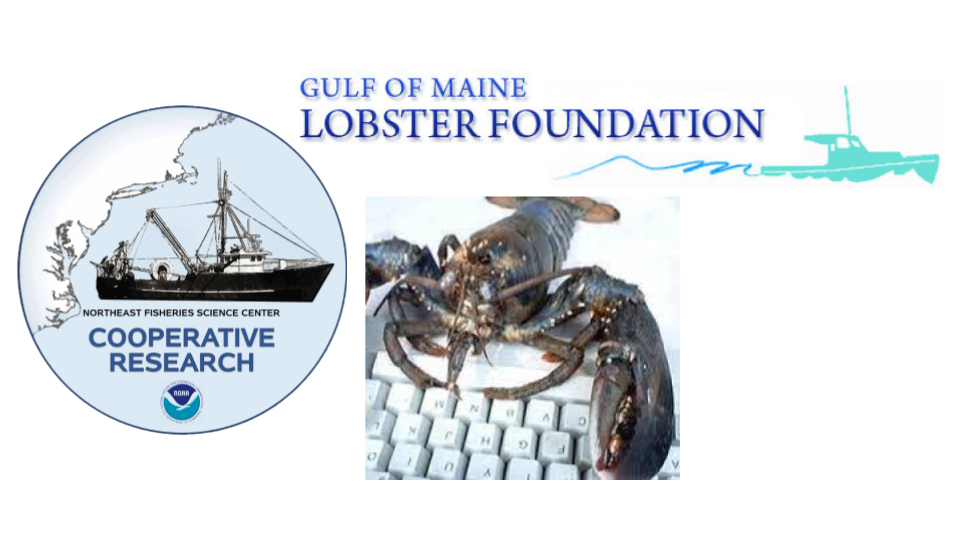

The eMOLT Program began in 1996 when JiM Manning, an oceanographer at NOAA's Northeast Fisheries Science Center began mailing small temperature loggers to lobstermen to zip-tie into their traps. The program began to scale up around 2001 when JiM joined forces with Erin Pelletier at the Gulf of Maine Lobster Foundation. Eventually, small sensors zip-tied into lobster traps monitored bottom temperature at over 400 sites around the region.

Around 2015, JiM and Erin worked with Lowell Instruments in Falmouth, Massachusetts to develop a bluetooth temperature and depth logger to enable faster data delivery from the fishing gear to fishermen on the boats and scientists onshore who could make use of the data. Thanks to the patience and tenacity of the engineers and fishermen participating in the program, after years of software development and hardware trials at sea, the eMOLT Program now deploys several different types of sensors up and down the East Coast.

Now jointly administered by NOAA's Northeast Fisheries Science Center and the Gulf of Maine Lobster Foundation in partnership with the fishing industry, tech companies, non-profits, and academic institutions, the eMOLT Program supports nearly 200 commercial fishing vessels collecting and delivering bottom temperature, temperature profiles, and dissolved oxygen data to decision makers in near-realtime.

## How does it work?

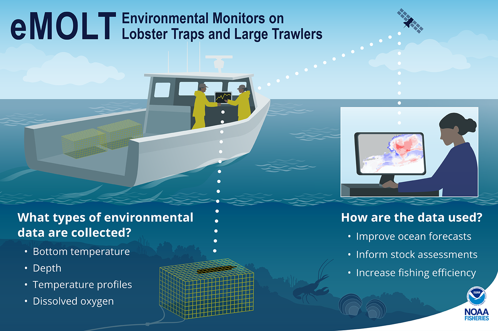

The eMOLT Program provides loggers and deckboxes to fishermen at no cost. Loggers are affixed to fishing gear, and deckboxes are installed in the wheelhouse. Each time the gear is hauled back, the logger offloads to the deckbox via bluetooth so the fishermen can see the data right away. When the deckbox connects to the internet, it automatically transfers the data to the Gulf of Maine Lobster Foundation's servers where it is QA/QC'd and anonymized before being made publicly available. This hands-free system allows for fishermen to collect critically needed environmental data to advance our collective understanding of how changing ocean conditions are affecting fisheries resources and fishing practices.

::::::::::::::::: {#slide-carousel .carousel .slide data-bs-ride="carousel"}
:::::::::::::::: carousel-inner
::: {.carousel-item .active}
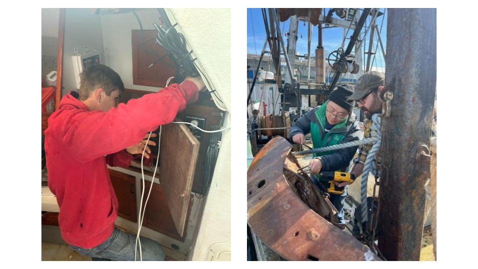{width="100%"}
:::

::: carousel-item
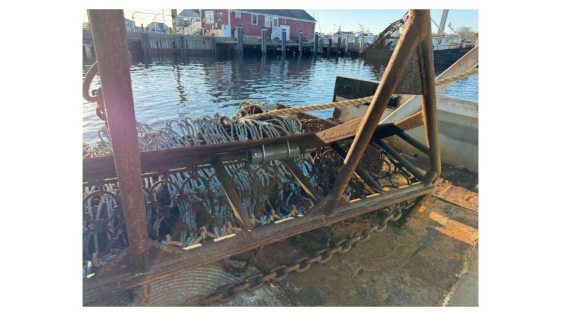{width="100%"}
:::

::: carousel-item
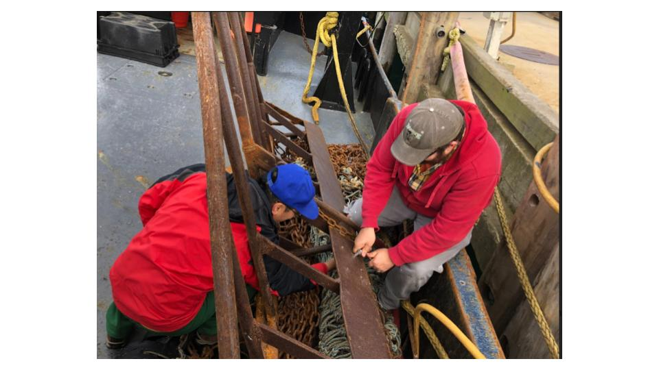{width="100%"}
:::

::: carousel-item
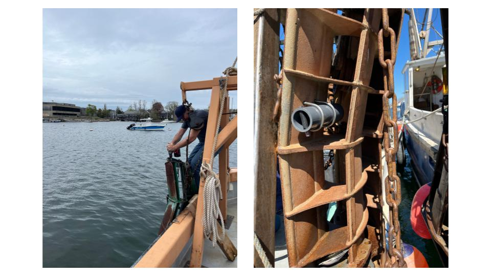{width="100%"}
:::

::: carousel-item
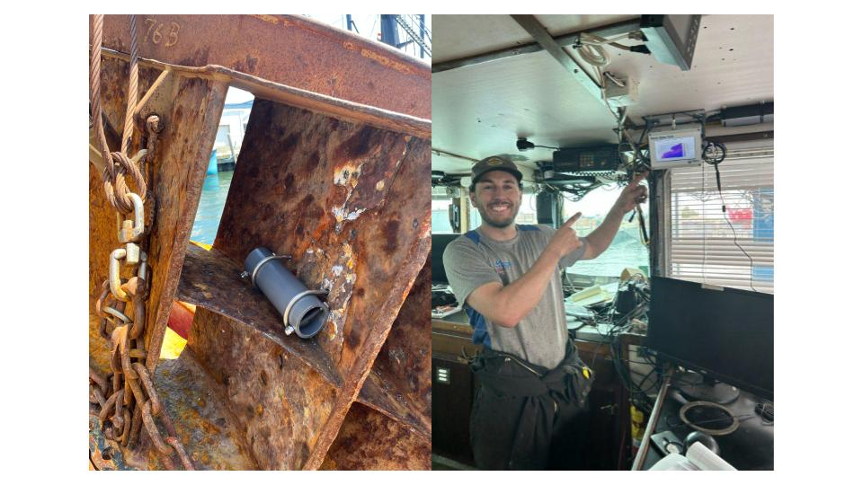{width="100%"}
:::

::: carousel-item
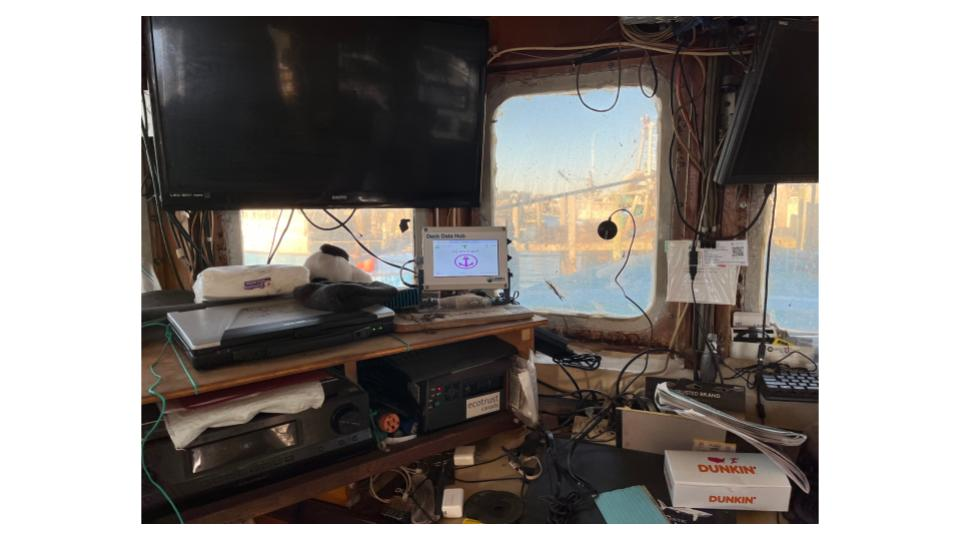{width="100%"}
:::

::: carousel-item
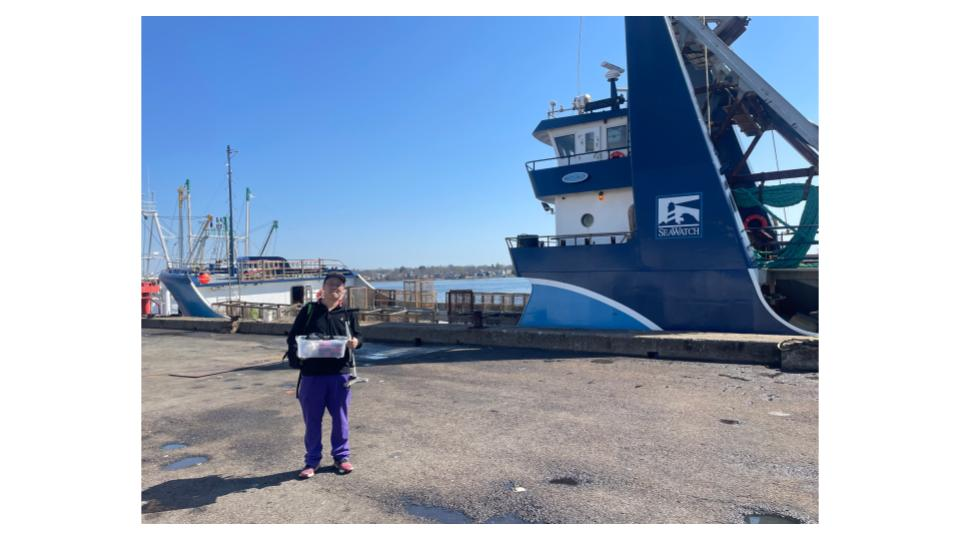{width="100%"}
:::

::: carousel-item
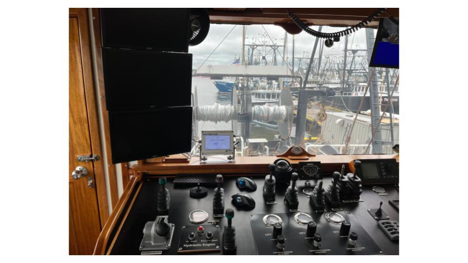{width="100%"}
:::

::: carousel-item
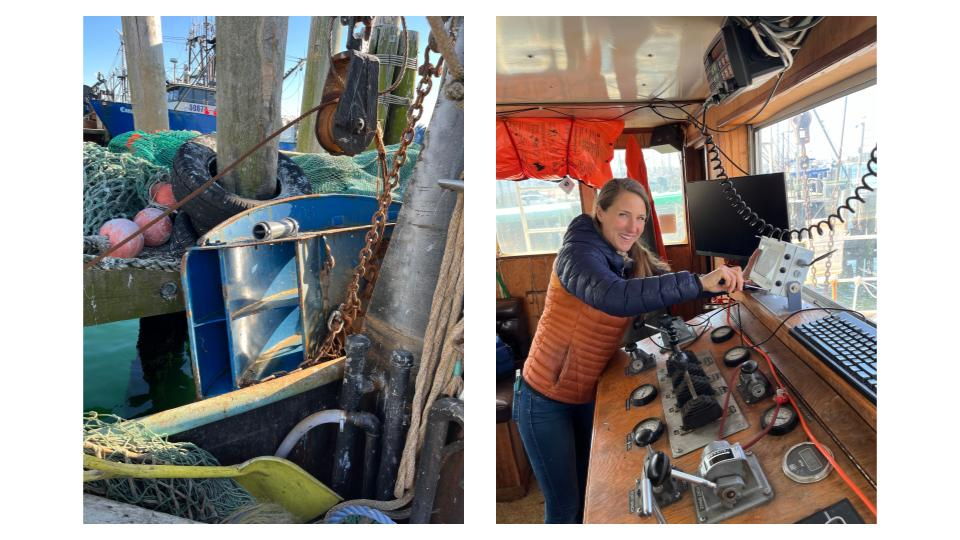{width="100%"}
:::

::: carousel-item
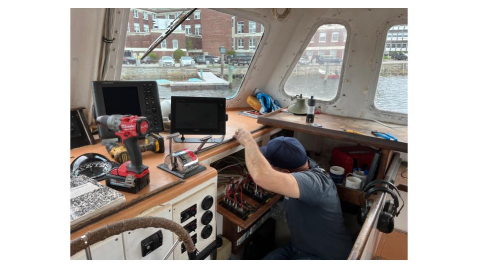{width="100%"}
:::

::: carousel-item
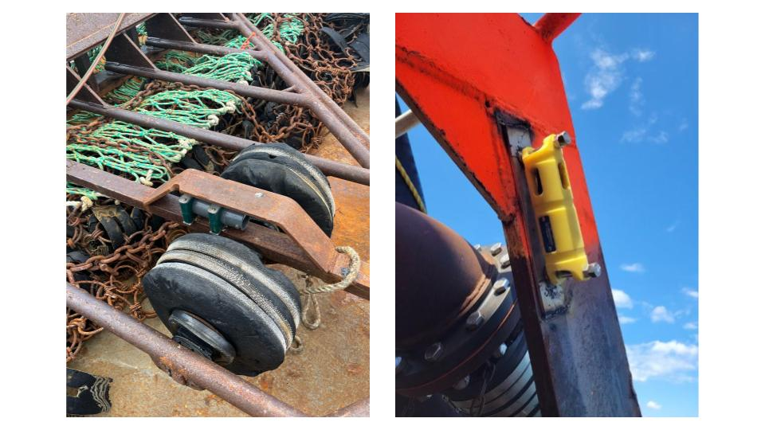{width="100%"}
:::

::: carousel-item
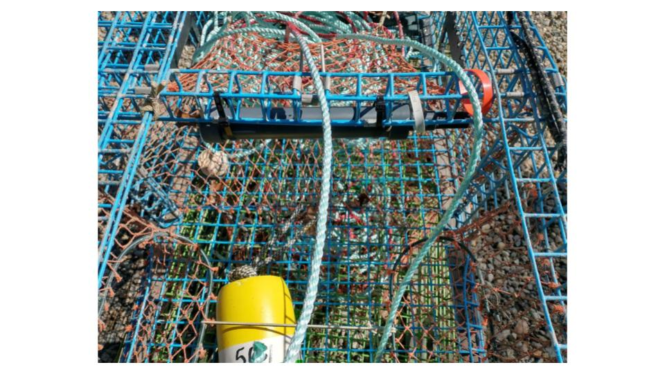{width="100%"}
:::

::: carousel-item
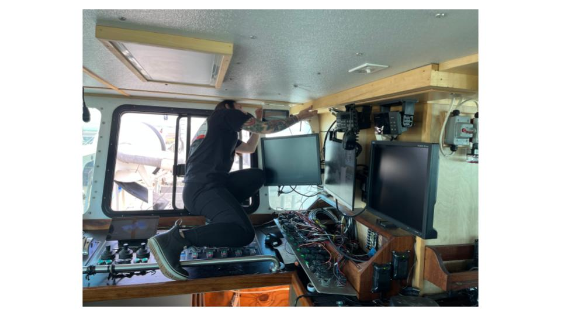{width="100%"}
:::
::::::::::::::::

<button class="carousel-control-prev" type="button" data-bs-target="#slide-carousel" data-bs-slide="prev">

[Previous]{.visually-hidden}

</button>

<button class="carousel-control-next" type="button" data-bs-target="#slide-carousel" data-bs-slide="next">

[Next]{.visually-hidden}

</button>
:::::::::::::::::

::: {style="clear: both; min-height: 20px;"}
:::

## Meet your Local Tech Support Team

::::: {layout-ncol="2"}

[Downeast Maine](tech_teams/downeast.qmd){.btn .btn-success role="button"}

[Mid-Coast and Southern ME, NH, and North Shore MA](tech_teams/sme.qmd){.btn .btn-primary role="button"}

[South Shore MA, Cape Cod, and the Islands](tech_teams/ssci.qmd){.btn .btn-danger role="button"}

[South Coast MA, RI, and CT](tech_teams/scri.qmd){.btn .btn-warning role="button"}

[Mid-Atlantic](tech_teams/ma.qmd){.btn .btn-info role="button"}

:::::
