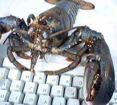

The eMOLT Program began in 1996 when JiM Manning, an oceanographer at NOAA's Northeast Fisheries Science Center began mailing small temperature loggers to lobstermen to zip-tie into their traps. The program began to scale up around 2001 when JiM joined forces with Erin Pelletier at the Gulf of Maine Lobster Foundation. Eventually, small sensors zip-tied into lobster traps monitored bottom temperature at over 400 sites around the region.

Around 2015, JiM and Erin worked with Lowell Instruments in Falmouth, Massachusetts to develop a bluetooth temperature and depth logger to enable faster data delivery from the fishing gear to fishermen on the boats and scientists onshore who could make use of the data. Thanks to the patience and tenacity of the engineers and fishermen participating in the program, after years of software development and hardware trials at sea, the eMOLT Program now deploys several different types of sensors up and down the East Coast.

Now jointly administered by NOAA's Northeast Fisheries Science Center and the Gulf of Maine Lobster Foundation in partnership with the fishing industry, tech companies, non-profits, and academic institutions, the eMOLT Program supports nearly 200 commercial fishing vessels collecting and delivering bottom temperature, temperature profiles, and dissolved oxygen data to decision makers in near-realtime.

## Meet your Local Tech Support Team

[Downeast Maine](tech_teams/downeast.qmd){.btn .btn-success role="button"}

-   Mid-Coast and Southern ME, NH, and North Shore MA
-   South Shore MA, Cape Cod, and The Islands
-   South Coast MA, RI, and CT
-   Mid-Atlantic
