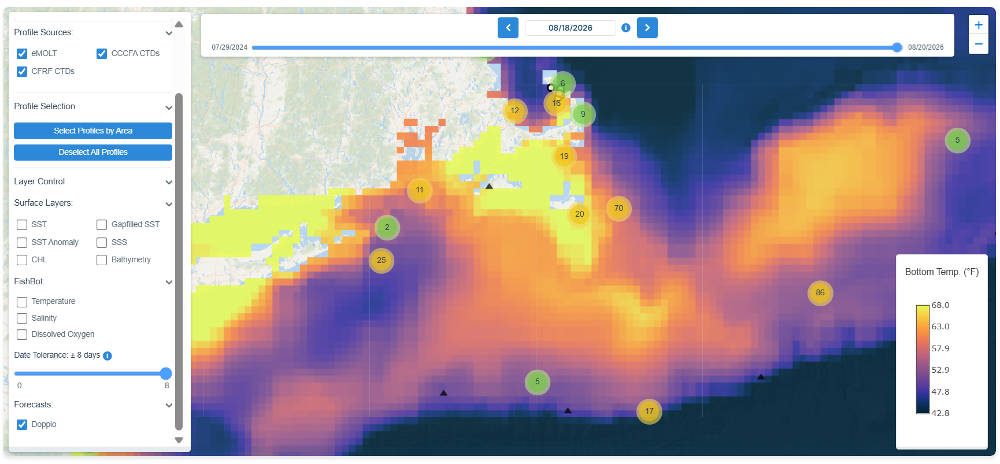
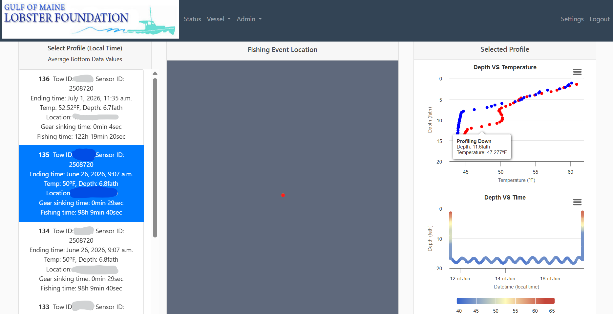
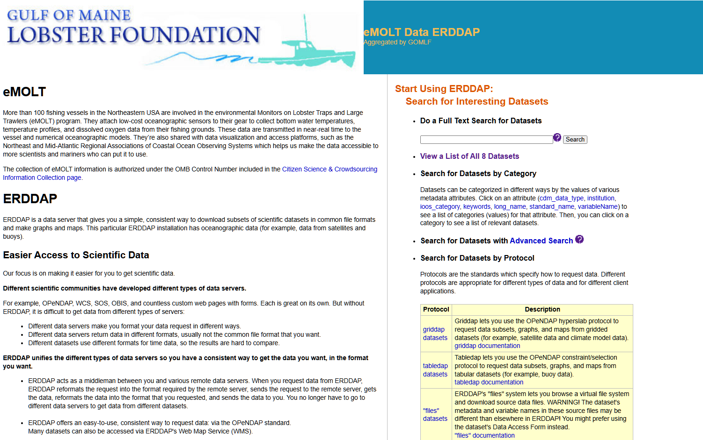
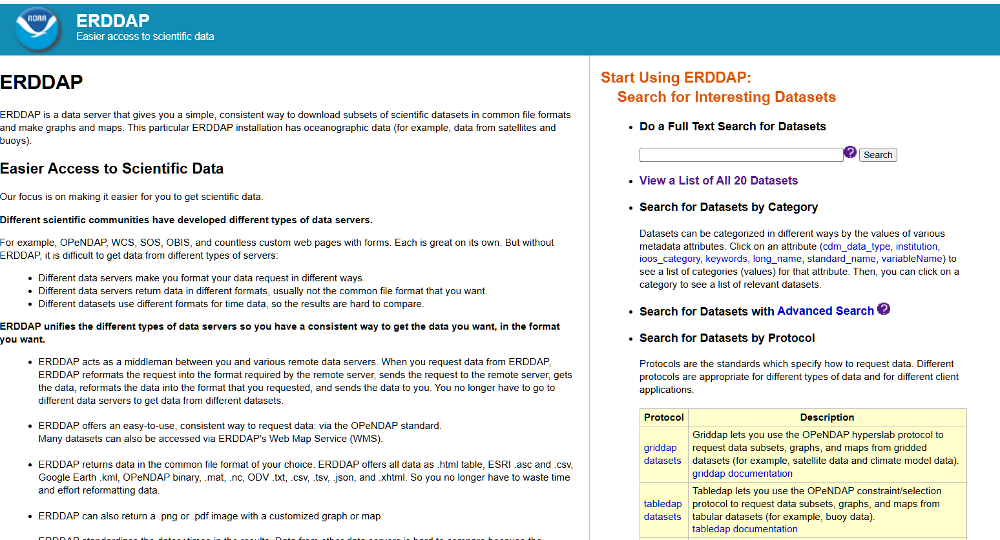

In an effort to protect the privacy of the fishermen who participate in the eMOLT Program, we do not make all of the data collected through the program public. Options for data access are described below. 

&.draw=markers&.marker=11%7C7&.color=0x000000&.colorBar=KT_thermal%7C%7C%7C%7C%7C&.bgColor=0xffccccff)

::::: {layout-ncol="2"}

### [Cape Cod Ocean Watch](https://ccocean.whoi.edu/)

Interact with anonymized, quality-controlled data from the eMOLT Program and other industry-based environmental data collection efforts alongside satellite sea surface temps, chlorophyll, and bottom temperature forecasts for the region in this online dashboard jointly developed by Woods Hole Oceanographic Institution, Commercial Fisheries Research Foundation, the Cape Cod Commercial Fishermen's Alliance, and the eMOLT team. 

### [Gulf of Maine Lobster Foundation Portal](https://www.portal.emolt.net/)

Captains and vessel owners participating in the eMOLT Program have access to a password protected, interactive online portal where they can see data from their vessels in much greater detail. This tool was developed by our partners at Ocean Data Network with funding from the Massachusetts Technology Collaborative. Click the link above to log in or request an account. 

### [Gulf of Maine Lobster Foundation ERDDAP](https://erddap.emolt.net/erddap/index.html)

Programmatically access anonymized data from the realtime eMOLT Program using an ERDDAP server as an API. This tool is best for people who want to pull data into analyses using Python or R. The data can be accessed in a filtered version (quality checks already applied, only good data returned) or unfiltered version (quality checks applied, all data returned).

### [Northeast Fisheries Science Center ERDDAP](https://comet.nefsc.noaa.gov/erddap/index.html)

Programmatically access anonymized data from the first few decades of the non-realtime eMOLT Program using an ERDDAP server as an API. This tool is best for people who want to pull data into analyses using Python or R. These data include bottom temperature only and depths are estimated by the fishermen who deployed the sensors.

:::::