

A Cooperative Ocean Observing Program

::::::::::::::::: {#slide-carousel .carousel .slide data-bs-ride="carousel"}
:::::::::::::::: carousel-inner
::: {.carousel-item .active}
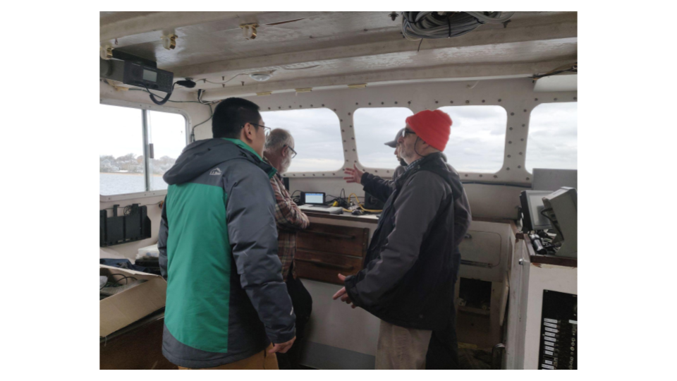{width="100%"}
:::

::: carousel-item
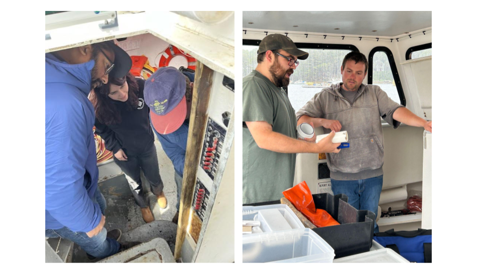{width="100%"}
:::

::: carousel-item
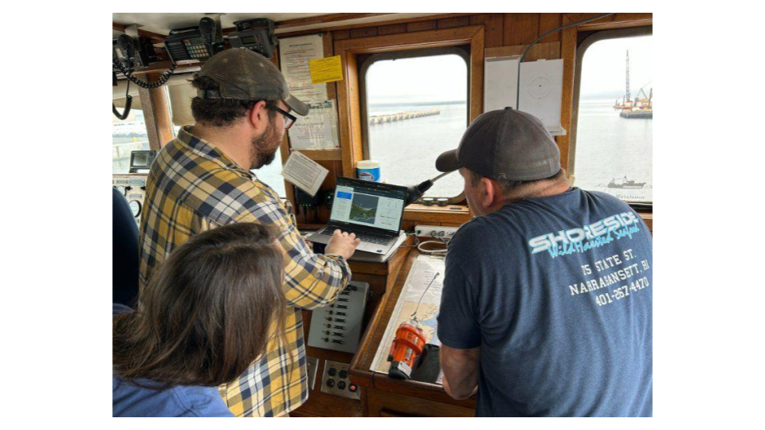{width="100%"}
:::

::: carousel-item
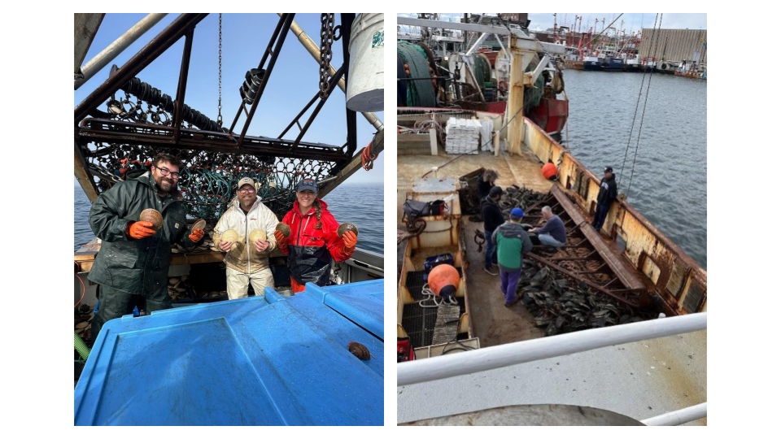{width="100%"}
:::

::: carousel-item
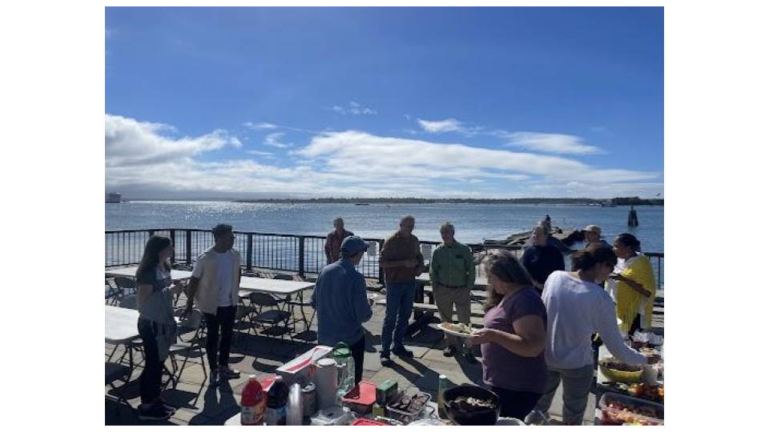{width="100%"}
:::

::: carousel-item
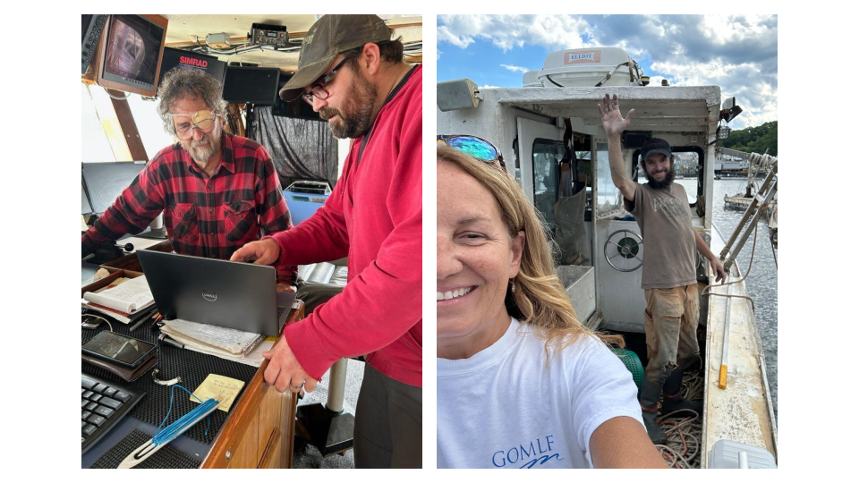{width="100%"}
:::

::: carousel-item
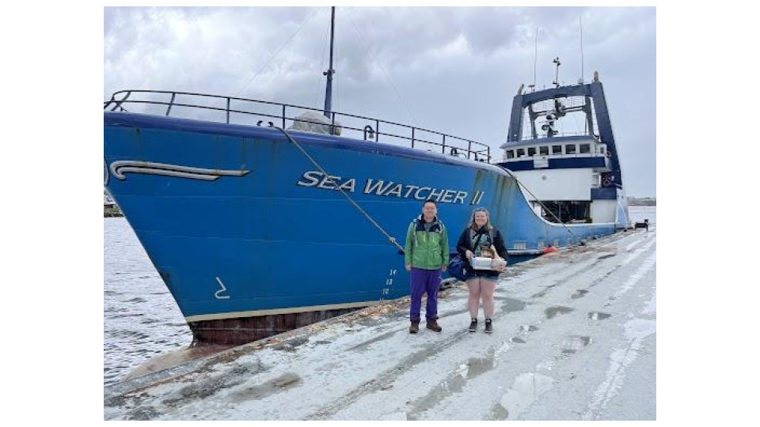{width="100%"}
:::

::: carousel-item
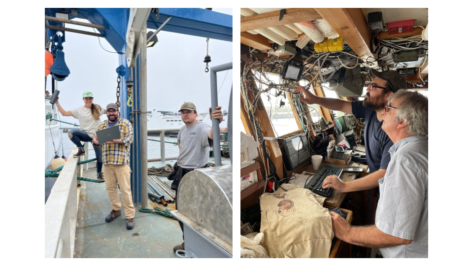{width="100%"}
:::

::: carousel-item
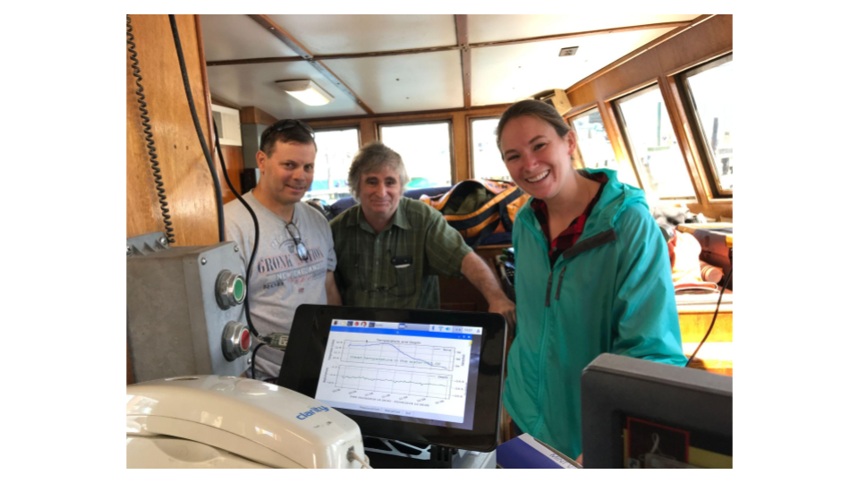{width="100%"}
:::

::: carousel-item
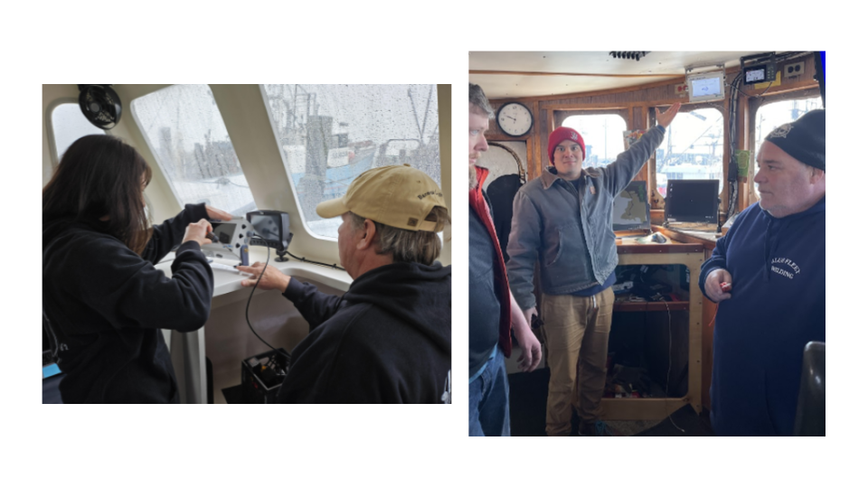{width="100%"}
:::

::: carousel-item
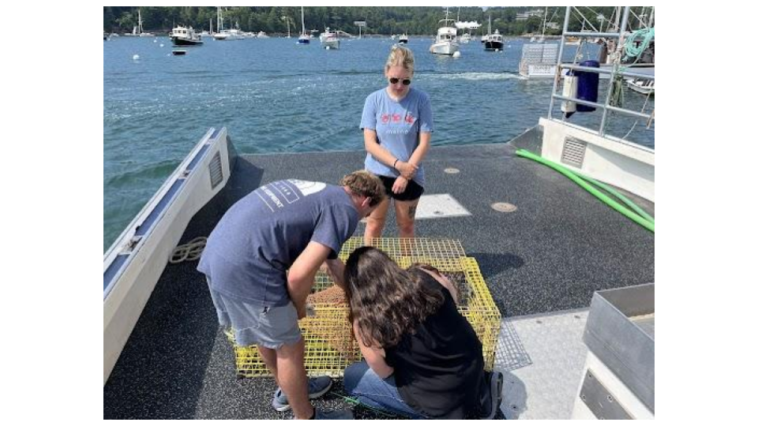{width="100%"}
:::
::::::::::::::::

<button class="carousel-control-prev" type="button" data-bs-target="#slide-carousel" data-bs-slide="prev">

[Previous]{.visually-hidden}

</button>

<button class="carousel-control-next" type="button" data-bs-target="#slide-carousel" data-bs-slide="next">

[Next]{.visually-hidden}

</button>
:::::::::::::::::

**The environmental Monitors on Lobster Traps and Large Trawlers (eMOLT) Program** is a collaborative effort between government agencies, academic institutions, non-profits, tech companies, and the commercial fishing industry in the Northeastern United States that aims to provide high quality, subsurface ocean measurements around the region in near-real time. Jointly administered by NOAA's Northeast Fisheries Science Center and the Gulf of Maine Lobster Foundation since 2001, the eMOLT Program relies on a distributed network of dockside technicians to help our partners in the fishing industry maintain the sensors aboard their vessels so that the resulting data can be used for fishing decision making, ocean forecasting, and fisheries stock assessments. For regular updates on the eMOLT Program and oceanography off the Northeastern United States, subscribe to our newsletter on LinkedIn by clicking the link on the bottom left. The collection of eMOLT information is authorized under the OMB Control Number included in the [Citizen Science & Crowdsourcing Information Collection page](https://www.fisheries.noaa.gov/national/science-data/citizen-science-crowdsourcing-information-collections).