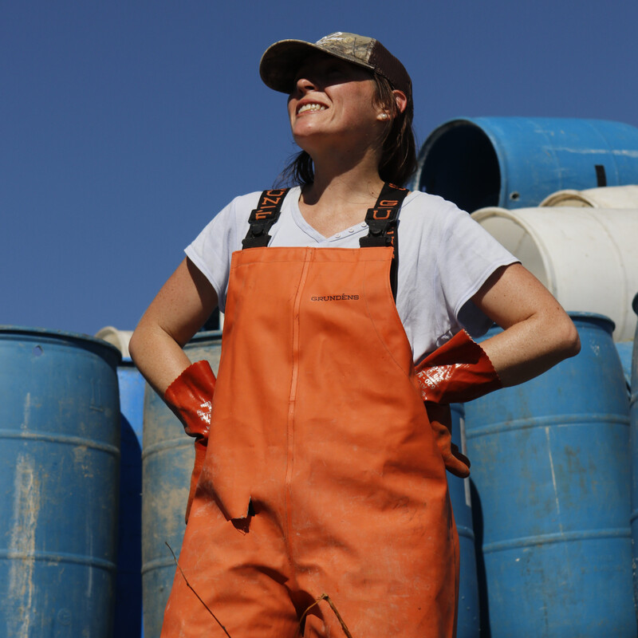
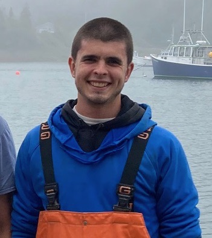

::: {layout-ncol="2"}
### Emma Weed

 Emma Weed is the Program Director at the Gulf of Maine Lobster Foundation. She grew up in Stonington, Maine in a multi-generational fishing family and recently earned a Master of Science in Program Management at Northeastern University's Roux Institute. 

- [Email](mailto:emma@gomlf.org)
- [LinkedIn](https://www.linkedin.com/in/ACoAACYNdfoB4HmaELnV-HzoNrCKTaWGtFko94c?skipRedirect=true&miniProfileUrn=urn%3Ali%3Afs_miniProfile%3AACoAACYNdfoB4HmaELnV-HzoNrCKTaWGtFko94c)

### Dr. Andrew Goode

 Dr. Andrew Goode is a postdoctoral scholar at the University of Maine who previously worked as a commercial lobsterman.

- [Email](mailto:andrew.goode@maine.edu)

:::
