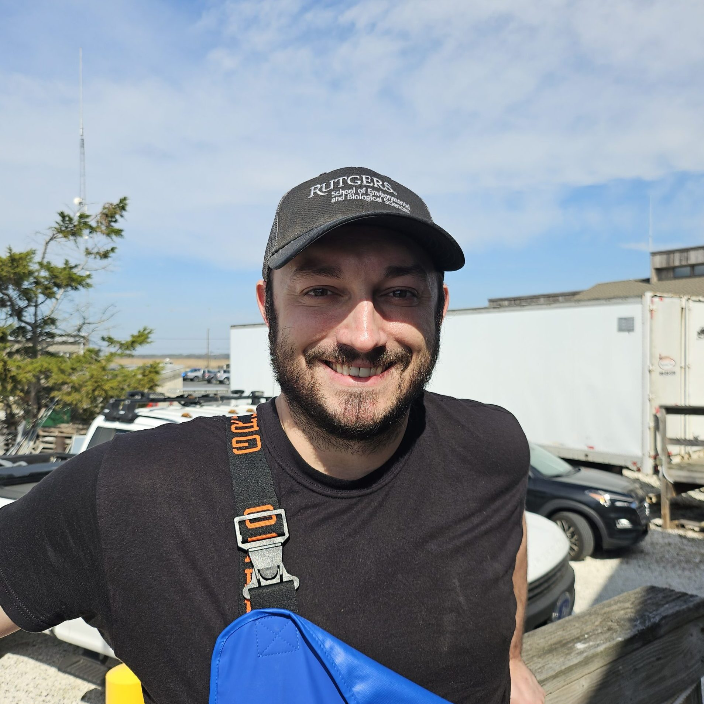
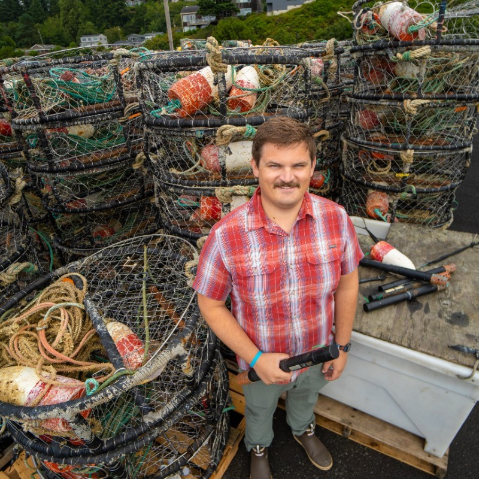

:::::: {layout-ncol="2"}

### Joey O'Brien

Joey is a laboratory researcher at the Haskin Shellfish Research Laboratory who works on cooperative research supporting fisheries management, aquaculture, and offshore development. Joey provides technical support to eMOLT Participants in Maryland and New Jersey.  

-   [Email](mailto:jo461@hsrl.rutgers.edu)

### Linus Stoltz

Linus is the Data Manager for the Commercial Fisheries Research Foundation. In addition to providing technical support for eMOLT participants in North Carolina, he also develops novel data products using observations from the eMOLT Program and complimentary projects at CFRF. 

-   [Email](mailto:nichols@coastalstudies.org)

::::::
