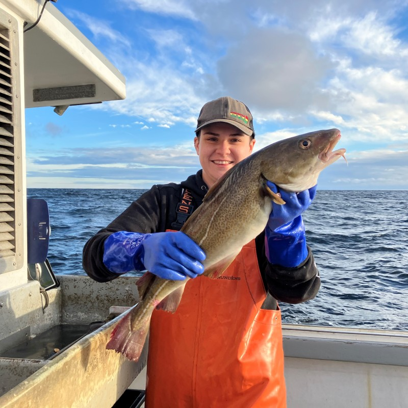

::::::: {layout-ncol="4"}

### Cassandra Tillotson

Cassie is a Research Assistant at the Coonamessett Farm Foundation where she supports a number of at-sea cooperative research projects. Cassie provides technical support to eMOLT participants on the South Coast of Massachusetts and Cape Cod.

-   [Email](ctillotson@cfarm.org)

### Dr. Samir Patel

Samir is a Senior Research Biologist at the Coonamessett Farm Foundation where he manages a number of cooperative research projects offshore and around Cape Cod. Samir provides technical support for eMOLT participants on the South Shore and the South Coast of Massachusetts. - [Email](spatel@cfarm.org)

### Luca McGinnis

Luca McGinnis is a Research Biologist at the Commercial Fisheries Research Foundation where they work at sea on projects related to wind farm monitoring and biological data collection. They also provide technical support for eMOLT participants in Rhode Island and New Bedford.

-   [Email](lmcginnis@cfrfoundation.org)
-   [LinkedIn](https://www.linkedin.com/in/luca-mcginnis-5a9875170/)

### Dr. Sarah Salois

Sarah is a Fisheries Biologist at the Northeast Fisheries Science Center's Narragansett Lab who supports cooperative research on commercially valuable forage species both at sea and in the lab. Sarah provides dockside support to eMOLT partners in Rhode Island and Connecticut, and develops new data products using observations from the program.

-   [Email](sarah.salois@noaa.gov)
-   [LinkedIn](https://www.linkedin.com/in/sarah-salois-946041355/)

:::::::
