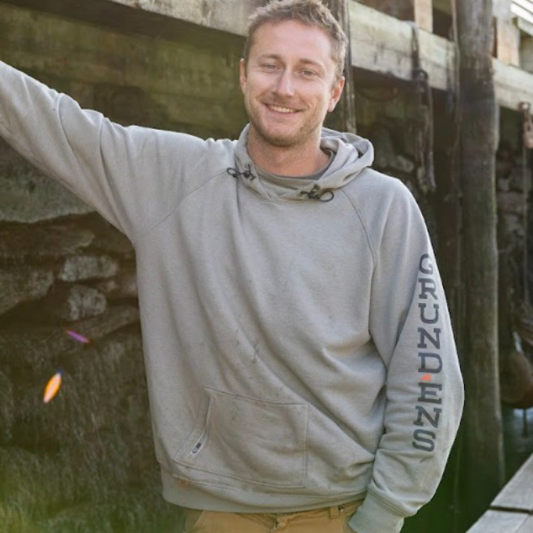

::::: {layout-ncol="2"}

### Erin Pelletier

Erin has been with GOMLF since 2003, and was promoted to Executive Director in 2007. During that time, she has worked to create robust collaborations between industry members, managers, and scientists in the Gulf of Maine waters. Erin services eMOLT systems in ports throughout Maine, New Hampshire, and Massachusetts. In addition to tech support, Erin also provides the bulk of the administrative support to the eMOLT Program making sure the bills are paid, the data keep flowing, and the cats get herded.

-   [Email](mailto:erin@gomlf.org)

### Jack Carroll

Jack handles Operations and Technical Development for Ocean Data Network and is a part time commercial fisherman. He is a National Marine Electronics Association (NMEA) certified installer who has installed deckboxes on vessels around the world. Jack services eMOLT systems in Portland and Gloucester.

-   [Email](mailto:jack@oceandata.net)
-   [LinkedIn](https://www.linkedin.com/in/jack-carroll-466b73168/)

:::::
