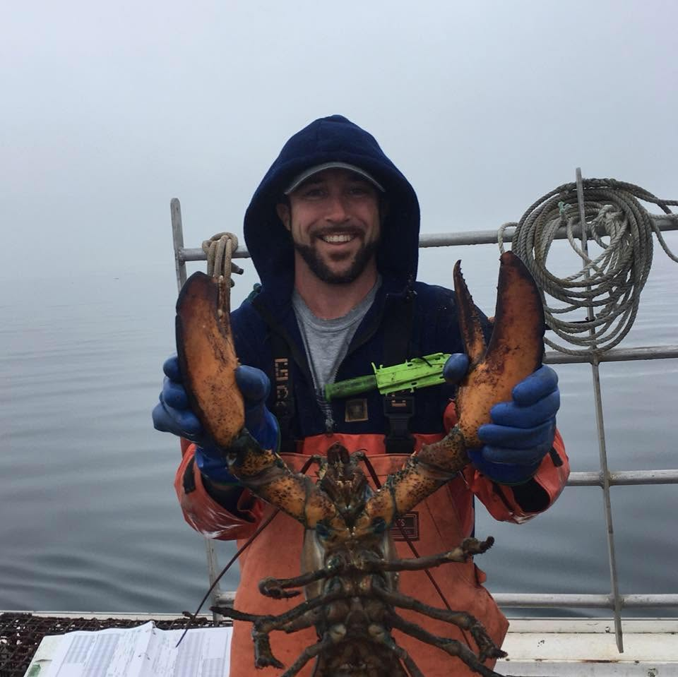
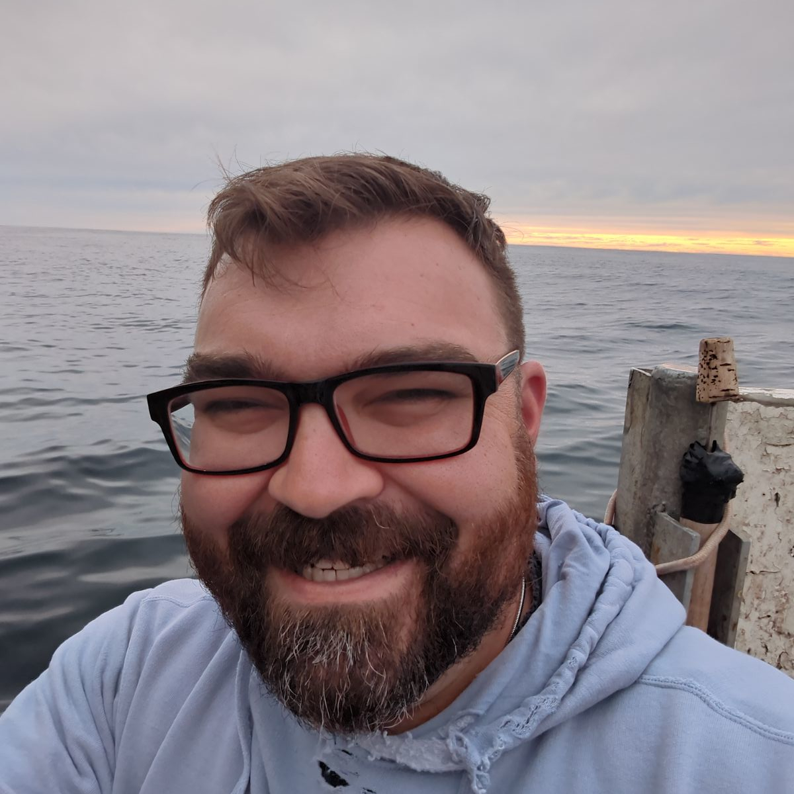

::::: {layout-ncol="3"}

### Huanxin Xu

Huanxin is the Technical Director for the Gulf of Maine Lobster Foundation and has played an active role in developing the software and hardware that support the eMOLT Program over the last decade. Huanxin provides dockside support to vessels from New Hampshire to Rhode Island, and remotely provides software updates and troubleshooting support to vessels around the region.

-   [Email](mailto:huanxin@gomlf.org)

### Owen Nichols

Owen is the Director of Marine Fisheries Research at the Center for Coastal Studies. A proponent of cooperative research, he has worked on the water with fishermen and aquaculturists for over two decades on a variety of projects. Owen provides support for eMOLT systems on Cape Cod.

-   [Email](mailto:nichols@coastalstudies.org)

### Dr. George Maynard

George is the eMOLT Coordinator at the Northeast Fisheries Science Center. He assists with dockside support throughout Southern New England and provides remote support for eMOLT systems and dockside tech teams between Maine and North Carolina. George also works with partners to secure funding for the program and ensure data delivery to end users.

-   [Email](mailto:george.maynard@noaa.gov)
-   [LinkedIn](https://www.linkedin.com/in/georgeamaynard/)

:::::
